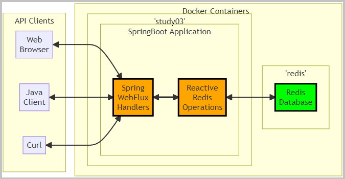
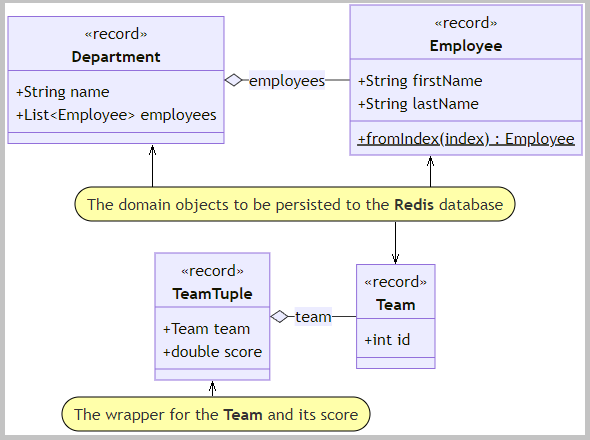
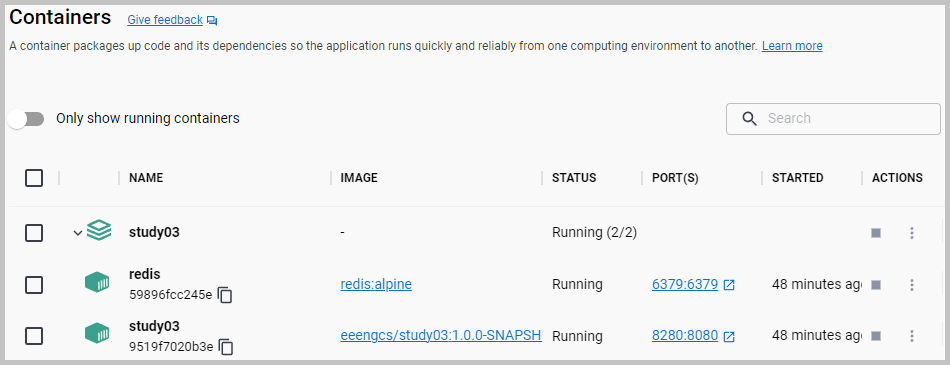
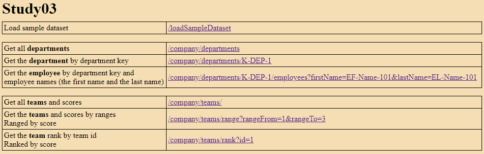
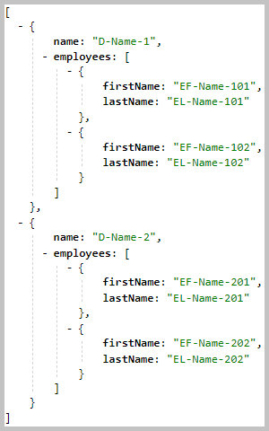
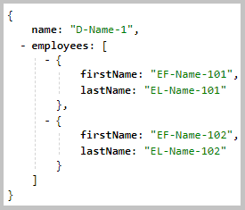
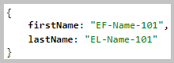
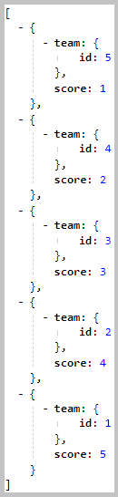
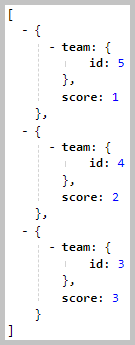

<!DOCTYPE html>
<HTML lang="en">
<META charset="UTF-8">
<BODY>

<H2 id="contents">Study03 README Contents</H2>

Topics: SpringBoot ● Spring WebFlux ● Reactive Streams ● Reactive REST ● Redis ● Docker ● WebTestClient

<H3 id="top">Research the Reactive REST Web Service</H3>

On the server-side, <b>WebFlux</b> supports two distinct programming models:

<UL>
<LI><i>Functional Endpoints</i></LI>
<LI><i>Annotated Controllers</i></LI>
</UL>

The project <b>Study03</b> implements one of them, the "<i>Functional Endpoints</i>" programming model.

 

<I>The flowchart with Docker containers '<b>study03</b>' and '<b>redis</b>'.</I>

<b>Redis</b> is an in-memory data structure store. 
The <a href="images/ScreenshotsRedisInsight.png">screenshots</a> from the
<a href="https://redis.com/redis-enterprise/redis-insight/">RedisInsight</a> (Redis data visualizer and optimizer).

The sections of this project:

<OL>
<LI><a href="#ONE"><b>Docker Build</b></a></LI>
<LI><a href="#TWO"><b>Web Browser Client</b></a></LI>
<LI><a href="#THREE"><b>Java Client</b></a></LI>
<LI><a href="#FOUR"><b>Curl Client</b></a></LI>
</OL>

Java source code. Packages: 
 

    <i>application sources</i>&nbsp;:&nbsp;
	<a href="https://github.com/k1729p/Study03/tree/main/src/main/java/kp">kp</a> 

    <i>test sources</i>&nbsp;:&nbsp;
	<a href="https://github.com/k1729p/Study03/tree/main/src/test/java/kp">kp</a> 

 

 

<I>The domain objects class diagram.</I>

 

<a href="http://htmlpreview.github.io/?https://github.com/k1729p/Study03/blob/main/docs/apidocs/index.html">
Java API Documentation</a>&nbsp;●&nbsp;
<a href="http://htmlpreview.github.io/?https://github.com/k1729p/Study03/blob/main/docs/testapidocs/index.html">
Java Test API Documentation</a> 

<H3 id="ONE">❶ Docker Build</H3>

Action: 
 
 1. With batch file
 <a href="https://github.com/k1729p/Study03/blob/main/0_batch/01%20Docker%20build%20and%20run.bat">
 <I>"01 Docker build and run.bat"</I></a> build the image and 
start the container with the SpringBoot server. 

1.1. Docker image is built using these files:
<a href="https://raw.githubusercontent.com/k1729p/Study03/main/docker-config/Dockerfile"><b>Dockerfile</b></a> and
<a href="https://raw.githubusercontent.com/k1729p/Study03/main/docker-config/compose.yaml"><b>compose.yaml</b></a>.

 

<I>The screenshot of the created Docker containers.</I>

<a href="#top">Back to the top of the page</a>

<H3 id="TWO">❷ Web Browser Client</H3>

Action: 
 
 1. With the URL <a href="http://localhost:8280">http://localhost:8280</a> open in the web browser the 
<a href="https://github.com/k1729p/Study03/blob/main/src/main/resources/static/index.html">home page</a>. 
 2. On this
<a href="https://github.com/k1729p/Study03/blob/main/src/main/resources/static/index.html">home page</a>
select 'Load sample dataset' <a href="http://localhost:8280/loadSampleDataset">http://localhost:8280/loadSampleDataset</a>. 

2.1. The <a href="https://github.com/k1729p/Study03/blob/main/src/main/resources/static/index.html">
home page</a> on the Docker link: <a href="http://localhost:8280/"><b>http://localhost:8280</b></a>. 

 

<I>The screenshot of the home page.</I>

Below are the results from some selected links on the home page.

2.2. The 'Get all <b>departments</b>' link: 
<a href="http://localhost:8280/company/departments">
http://localhost:8280/company/departments</a>.

The handler method:
<a href="https://github.com/k1729p/Study03/blob/main/src/main/java/kp/company/handlers/DepartmentHandler.java#L49">
kp.company.handlers.DepartmentHandler::handleDepartments</a>. 

 

<I>The result from the 'Get all <b>departments</b>'.</I>

2.3. The 'Get the <b>department</b> by department key' link: 
<a href="http://localhost:8280/company/departments/K-DEP-1">
http://localhost:8280/company/departments/K-DEP-1</a>.

The handler method:
<a href="https://github.com/k1729p/Study03/blob/main/src/main/java/kp/company/handlers/DepartmentHandler.java#L71">
kp.company.handlers.DepartmentHandler::handleDepartmentByDepartmentKey</a>. 

 

<I>The result from the 'Get the <b>department</b> by department key'.</I>

2.4. The 'Get the <b>employee</b> by department key and employee names' link: 
<a href="http://localhost:8280/company/departments/K-DEP-1/employees/?firstName=EF-Name-101&lastName=EL-Name-101">
http://localhost:8280/company/departments/K-DEP-1/employees/?firstName=EF-Name-101&lastName=EL-Name-101</a>.

The handler method:
<a href="https://github.com/k1729p/Study03/blob/main/src/main/java/kp/company/handlers/EmployeeHandler.java#L50">
kp.company.handlers.EmployeeHandler::handleEmployeeByDepartmentKeyAndNames</a>. 

 

<I>The result from the 'Get the <b>employee</b> by department key and employee names'.</I>

2.5. The 'Get all <b>teams</b> and scores' link: 
<a href="http://localhost:8280/company/teams">
http://localhost:8280/company/teams</a>.

The handler method:
<a href="https://github.com/k1729p/Study03/blob/main/src/main/java/kp/company/handlers/TeamHandler.java#L52">
kp.company.handlers.TeamHandler::handleTeams</a>. 

 

<I>The result from the 'Get all <b>teams</b> and scores'.</I>

2.6. The 'Get the <b>teams</b> and scores by ranges' link: 
<a href="http://localhost:8280/company/teams/range?rangeFrom=1&rangeTo=3">
http://localhost:8280/company/teams/range?rangeFrom=1&rangeTo=3</a>.

The handler method:
<a href="https://github.com/k1729p/Study03/blob/main/src/main/java/kp/company/handlers/TeamHandler.java#L78">
kp.company.handlers.TeamHandler::handleTeamsRangeByScore</a>. 

 

<I>The result from the 'Get the <b>teams</b> and scores by ranges'.</I>

2.7. The 'Get the <b>team</b> rank by team id' link: 
<a href="http://localhost:8280/company/teams/rank?id=1">
http://localhost:8280/company/teams/rank?id=1</a>.

The handler method:
<a href="https://github.com/k1729p/Study03/blob/main/src/main/java/kp/company/handlers/TeamHandler.java#L115">
kp.company.handlers.TeamHandler::handleTeamRankById</a>. 

 

<I>The result from the 'Get the <b>team</b> rank by team id'.</I>

<a href="#top">Back to the top of the page</a>

<H3 id="THREE">❸ Java Client</H3>

Action: 
 
 1. With batch file
 <a href="https://github.com/k1729p/Study03/blob/main/0_batch/03%20MVN%20clean%20install%20execute%20client.bat">
 <I>"03 MVN clean install execute client.bat"</I></a> launch the Java client. 

3.1. The client application <a href="https://github.com/k1729p/Study03/blob/main/src/main/java/kp/client/WebClientLauncher.java">
kp.client.WebClientLauncher</a>. 
The method 
<a href="https://github.com/k1729p/Study03/blob/main/src/main/java/kp/client/WebClientLauncher.java#L58">
kp.client.WebClientLauncher::performRequests</a> starts three subscribers: 
<a href="https://github.com/k1729p/Study03/blob/main/src/main/java/kp/client/subscribers/DepartmentSubscriber.java">DepartmentSubscriber</a>, 
<a href="https://github.com/k1729p/Study03/blob/main/src/main/java/kp/client/subscribers/EmployeeSubscriber.java">EmployeeSubscriber</a>, 
<a href="https://github.com/k1729p/Study03/blob/main/src/main/java/kp/client/subscribers/TeamSubscriber.java">TeamSubscriber</a>.

The <a href="images/ScreenshotJavaClient.png">
<b>screenshot</b></a>
of the console log from the run of the batch file <b>"03 MVN clean install execute client.bat"</b>

<a href="#top">Back to the top of the page</a>

<H3 id="FOUR">❹ Curl Client</H3>

Action: 
 
 1. With batch file
 <a href="https://github.com/k1729p/Study03/blob/main/0_batch/04%20CURL%20call%20server.bat">
 <I>"04 CURL call server.bat"</I></a> load the sample dataset and get departments and employees. 

4.1. The <a href="images/ScreenshotCurlCallServer.png">
<b>screenshot</b></a>
of the console log from the run of the batch file <b>"04 CURL call server.bat"</b>

<a href="#top">Back to the top of the page</a>

</BODY>
</HTML>