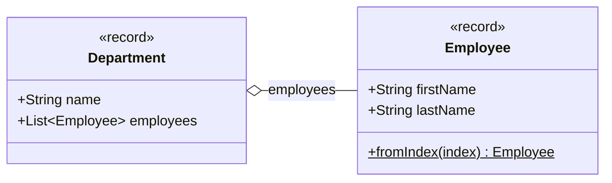
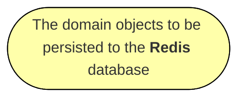
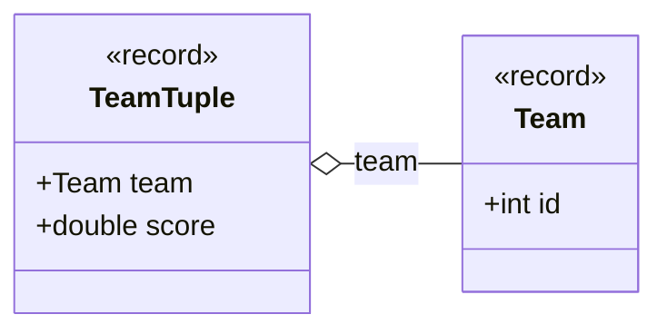
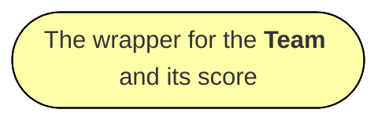

```mermaid
classDiagram
direction RL
class Department {
 <<record>>
 +String name
 +List~Employee~ employees
}
class Employee {
 <<record>>
 +String firstName
 +String lastName
 +fromIndex(index)$ Employee
}

Employee --o Department  : employees
```

```mermaid
flowchart LR
box([The domain objects to be persisted to the <b>Redis</b> database]):::lightYellowBox
classDef lightYellowBox fill:#ffffaa,stroke:#000
```

```mermaid
classDiagram
direction RL
class TeamTuple{
 <<record>>
 +Team team
 +double score
}
class Team {
 <<record>>
 +int id
}

Team --o TeamTuple : team
```

```mermaid
flowchart LR
box([The wrapper for the <b>Team</b> and its score]):::lightYellowBox
classDef lightYellowBox fill:#ffffaa,stroke:#000
```

