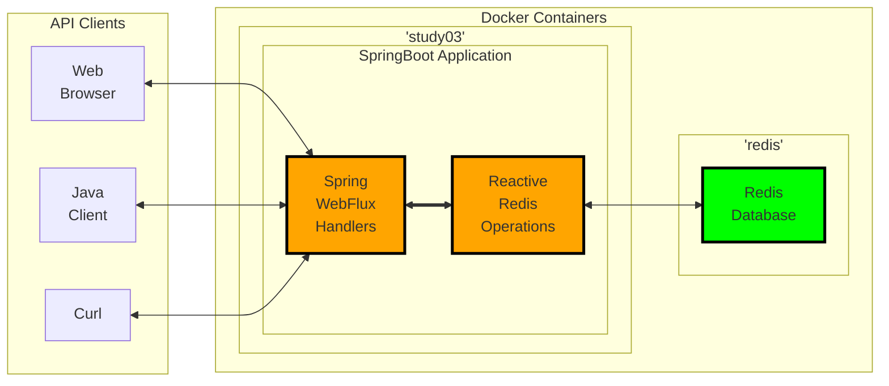

```mermaid
flowchart LR
 subgraph Docker Containers
  subgraph 'study03'
   subgraph SpringBoot Application
    WFH[Spring\nWebFlux\nHandlers]
	ROP[Reactive\nRedis\nOperations]
   end
  end
  subgraph 'redis'
   RED[Redis\nDatabase]
  end
 end
 subgraph API Clients
  WBR[Web\nBrowser]
  JCL[Java\nClient]
  CURL[Curl]
 end

 WBR <--> WFH:::orangeBox
 JCL <--> WFH
 CURL <--> WFH
 WFH <==> ROP:::orangeBox
 ROP <--> RED:::greenBox
 
 classDef greenBox   fill:#00ff00,stroke:#000,stroke-width:3px
 classDef orangeBox  fill:#ffa500,stroke:#000,stroke-width:3px
```